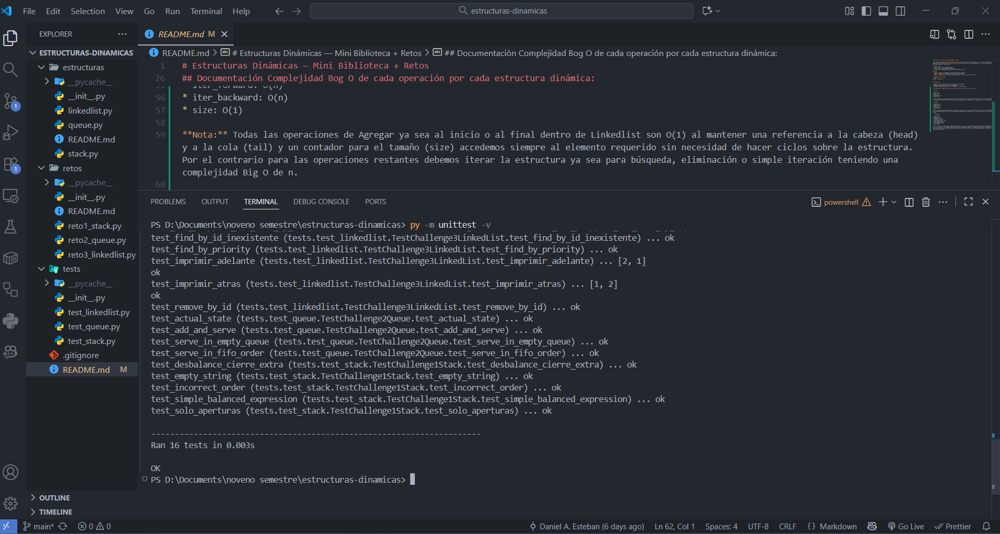

# Estructuras Dinámicas — Mini Biblioteca + Retos

Este repo contiene una **mini-biblioteca de estructuras** (Stack, Queue, LinkedList) y **3 retos** aplicados. La intención es practicar TDD: primero verás **pruebas unitarias iniciales** que fallan (fase *Red*), luego implementarás el mínimo código para hacerlas pasar (*Green*), y finalmente mejorarás (*Refactor*).

## Estructuras
- `Stack` sobre lista enlazada simple.
- `Queue` sobre lista doblemente enlazada.
- `LinkedList` (doblemente enlazada) con operaciones básicas.

## Retos
- **Reto 1 (Stack):** Validador de paréntesis/llaves/corchetes.
- **Reto 2 (Queue):** Simulador de cola de atención (FIFO).
- **Reto 3 (LinkedList):** Gestor de tareas (insertar, eliminar, buscar, recorrer).

## Cómo ejecutar pruebas
```bash
python -m unittest -v
```

## Sugerencias

* Sigue el patrón AAA (Arrange, Act, Assert) en las pruebas.
* Agrega más casos (bordes, errores esperados).
* Documenta complejidades Big-O en los READMEs de cada carpeta.

## Documentación Complejidad Bog O de cada operación por cada estructura dinámica:

- `Stack:` 

* push: O(1)
* pop: O(1)
* peek: O(1)
* is_empty: O(1)
* size: O(1)

**Nota:** Todas las operaciones dentro de Stack son O(1) al ser una estructura LIFO (Last In First Out) accedemos siempre al elemento requerido sin necesidad de hacer ciclos sobre la estructura manteniendo una referencia a la cabeza (top) y un contador para el tamaño (size)

- `Queue:`

* enqueue: O(1)
* dequeue: O(1)
* peek: O(1)
* is_empty: O(1)
* size: O(1)

**Nota:** Todas las operaciones dentro de Queue son O(1) al ser una estructura FIFO (First In First Out) accedemos siempre al elemento requerido sin necesidad de hacer ciclos sobre la estructura manteniendo una referencia a la cabeza (head) y a la cola (tail) y un contador para el tamaño (size)

- `LinkedList:`

* append: O(1)
* prepend: O(1)
* remove_by_id: O(n)
* find_by_id: O(n)
* find_by_prioridad: O(n)
* iter_forward: O(n)
* iter_backward: O(n)
* size: O(1)

**Nota:** Todas las operaciones de Agregar ya sea al inicio o al final dentro de Linkedlist son O(1) al mantener una referencia a la cabeza (head) y a la cola (tail) y un contador para el tamaño (size) accedemos siempre al elemento requerido sin necesidad de hacer ciclos sobre la estructura. Por el contrario para las operaciones restantes debemos iterar la estructura ya sea para búsqueda, eliminación o simple iteración teniendo una complejidad Big O de n.

## Evidencias:




